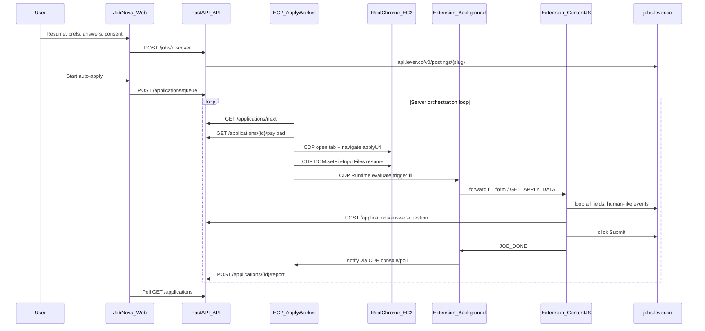

# Lever EC2 Auto-Apply Rebuild

## Why the current approach fails

The existing stack tries to auto-apply **Greenhouse** forms from the **user's local Chrome extension**. Greenhouse uses heavy React/remix-select forms that ignore simple `.value` assignment. The current [`lever.js`](extensions/auto-apply/lever.js) only fills 3 fields and clicks submit — too simple for real Lever forms.

You confirmed: **Lever only** + **EC2 server only**.

| Current (broken) | New (your architecture) |
|------------------|-------------------------|
| User's local Chrome + extension self-polls | EC2 runs real Chrome with extension pre-loaded |
| `lever.js` fills name/email/phone only | Loop **all** fields: resume, custom Qs, EEO, LinkedIn |
| No CDP control layer | Backend connects `ws://localhost:9222` — **missing control layer** |
| Greenhouse React forms | Lever standard HTML — simpler but needs full field loop |
| User reloads extension manually | Server orchestration loop — zero human interaction |

---

## Target architecture



---

## Step 1 — Run real Chrome on EC2 (not headless)

**Install on EC2 (Amazon Linux):**
```bash
sudo yum install -y google-chrome-stable xvfb x11vnc
```

**Launch Chrome:**
```bash
DISPLAY=:99 google-chrome \
  --remote-debugging-port=9222 \
  --disable-blink-features=AutomationControlled \
  --load-extension=/home/ec2-user/jobnova-extension \
  --user-data-dir=/home/ec2-user/chrome-profile \
  --no-sandbox \
  --no-first-run \
  about:blank
```

This gives:
- A **real browser** (not headless) — bypasses bot detection
- Extension loaded at `/home/ec2-user/jobnova-extension`
- Persistent profile at `/home/ec2-user/chrome-profile`
- Remote control via CDP on port 9222
- Optional VNC via `x11vnc` for debugging

---

## Step 2 — Control Chrome from backend (missing control layer)

Apply worker connects to:
```
ws://localhost:9222/devtools/browser/<id>
```
(via Playwright `connect_over_cdp("http://127.0.0.1:9222")`)

**Per job:**
1. Open a new tab
2. Navigate to Lever `applyUrl`
3. Upload resume via CDP `DOM.setFileInputFiles`
4. Trigger extension to fill
5. **Wait for `JOB_DONE` message**
6. Report result to API

This is the layer the current code is missing — the extension alone cannot orchestrate itself reliably.

---

## Step 3 — Upgrade Lever automation (replace current lever.js)

Current [`lever.js`](extensions/auto-apply/lever.js) is too simple:
```javascript
setInput(form.querySelector('input[name="name"]'), name);
setInput(form.querySelector('input[name="email"]'), profile.email);
setInput(form.querySelector('input[name="phone"]'), "0000000000");
submit.click();
```

**New `content.js` must add:**

### Resume upload (dual approach)
- **Primary:** Worker uploads via CDP `DOM.setFileInputFiles` on `input[type="file"][name="resume"]`
- **Fallback in content.js:**
```javascript
function uploadResume(base64, filename, mime) {
  const input = document.querySelector('input[type="file"][name="resume"]');
  const bytes = Uint8Array.from(atob(base64), c => c.charCodeAt(0));
  const file = new File([bytes], filename, { type: mime });
  const dt = new DataTransfer();
  dt.items.add(file);
  input.files = dt.files;
  input.dispatchEvent(new Event("change", { bubbles: true }));
}
```

### Custom questions (Lever-specific selectors)
Loop all fields in `form.applications-form`:
- `textarea[name^="questions"]` — AI answer via Groq API
- `input[name="urls[linkedin]"]` — from `answers.linkedin_url`
- `input[name^="urls"]` — other URL fields
- Text inputs with labels containing "location", "intend to work" — from `answers.city`

### EEO fields (map like Greenhouse)
Lever uses `select[name="eeo[...]"]`:
- `select[name="eeo[gender]"]` → `answers.gender`
- `select[name="eeo[race]"]` → `answers.race`
- `select[name="eeo[veteran]"]` → `answers.veteran_status`
- `select[name="eeo[disability]"]` → `answers.disability_status`

Match option text with same scoring logic as Greenhouse (exact match, partial, "decline", yes/no).

### Field loop pattern
```javascript
for (const field of form.querySelectorAll("input, textarea, select")) {
  if (alreadyFilled(field)) continue;
  await humanDelay();
  field.scrollIntoView({ behavior: "smooth", block: "center" });
  await fillField(field, ctx);  // dispatch real DOM events
}
```

---

## Step 4 — Human-like interaction (avoid detection)

Every field fill must include:
```javascript
const humanDelay = () => sleep(300 + Math.random() * 400);

el.scrollIntoView({ behavior: "smooth", block: "center" });
el.focus();
el.dispatchEvent(new KeyboardEvent("keydown", { bubbles: true }));
// set value via native setter
el.dispatchEvent(new InputEvent("input", { bubbles: true }));
el.dispatchEvent(new Event("change", { bubbles: true }));
el.dispatchEvent(new KeyboardEvent("keyup", { bubbles: true }));
el.blur();
await humanDelay();
```

---

## Step 5 — Background controller (brain of extension)

[`background.js`](extensions/auto-apply/background.js) responsibilities:

| Responsibility | Implementation |
|----------------|----------------|
| Store token | `chrome.storage.local` — API bearer for content script calls |
| Store profile | Cached from worker via `SET_APPLY_DATA` message |
| Store job data | Current `activeJob` (id, title, company, applyUrl) |
| Respond to `GET_APPLY_DATA` | Return profile + answers + resume base64 to content script |
| Receive `JOB_DONE` | Forward status to worker (via `chrome.storage` flag worker polls) |
| Notify backend | Content script calls API directly OR background relays report |

Worker pre-loads data before navigating:
```javascript
chrome.storage.local.set({ token, profile, answers, job, resume });
```

Content script on page load:
```javascript
const data = await send({ type: "GET_APPLY_DATA" });
await fillAllFields(data);
await send({ type: "JOB_DONE", status, message });
```

---

## Step 6 — Server-side orchestration loop

**New service:** `services/apply-worker/main.py`

```python
while True:
    job = api.get("/applications/next")
    if not job: sleep(5); continue

    payload = api.get(f"/applications/{job.id}/payload")
    api.post(f"/applications/{job.id}/report", status="in_progress")

    page = cdp.new_page()
    page.goto(payload.apply_url)
    cdp.set_file_input("input[name='resume']", payload.resume_path)
    cdp.evaluate("chrome.storage.local.set({...})")  # preload extension data
    cdp.evaluate("chrome.runtime.sendMessage({action:'fill_form'})")

    result = wait_for_job_done(timeout=120)  # poll storage or console
    api.post(f"/applications/{job.id}/report", status=result.status, message=result.message)

    page.close()
    sleep(3)
```

This is the **missing automation loop** — fetch → open → navigate → wait → log → next.

---

## Phase 1 — Lever job discovery (API)

**New:** [`services/api/app/data/lever_boards.py`](services/api/app/data/lever_boards.py) — curated Lever slugs

**New:** [`services/api/app/services/lever_discovery.py`](services/api/app/services/lever_discovery.py)
- `GET https://api.lever.co/v0/postings/{slug}?mode=json`
- Use `applyUrl` from each job
- Reuse [`job_matcher.py`](services/api/app/services/job_matcher.py) scoring

**Update:** [`job_discovery.py`](services/api/app/services/job_discovery.py) — switch from Greenhouse to Lever

---

## Phase 2 — Extension rebuild

**Files in [`extensions/auto-apply/`](extensions/auto-apply/):**

| File | Role |
|------|------|
| `manifest.json` | MV3, `jobs.lever.co/*` only, permissions: storage, tabs |
| `background.js` | Brain: store data, GET_APPLY_DATA, JOB_DONE relay |
| `content.js` | Full Lever filler: loop fields, resume fallback, EEO, AI Qs, human delays |
| Delete `greenhouse.js`, `lever.js`, `bridge.js` | No longer needed |

---

## Phase 3 — Apply worker (CDP service)

**New:** `services/apply-worker/`
- `main.py` — orchestration loop (Step 6)
- `chrome_launcher.py` — Step 1 launch command
- `cdp_session.py` — Playwright `connect_over_cdp`
- `apply_job.py` — per-job: navigate, resume CDP upload, trigger fill, wait JOB_DONE
- `requirements.txt` — playwright, httpx

---

## Phase 4 — API worker endpoints

**New env vars:**
```
APPLY_WORKER_SECRET=<shared-secret>
API_URL=http://<api-host>:8000
```

| Endpoint | Auth | Purpose |
|----------|------|---------|
| `GET /applications/next` | `X-Worker-Secret` | Next queued job |
| `GET /applications/{id}/payload` | `X-Worker-Secret` | Profile, answers, resume file on disk |
| `POST /applications/{id}/report` | `X-Worker-Secret` | Status update |
| `POST /applications/worker/heartbeat` | `X-Worker-Secret` | Worker alive signal |

Queue: validate `apply_url` contains `lever.co`

---

## Phase 5 — Frontend

[`AutoApplyPanel.tsx`](apps/web/src/components/AutoApplyPanel.tsx):
- Remove "load unpacked extension" instructions
- Remove `postMessage(JOBNOVA_START_AUTO_APPLY)`
- Filter: `apply_url.includes("lever.co")`
- Show: "Server is applying to jobs on EC2…"
- Poll worker heartbeat for status

---

## Phase 6 — EC2 deployment

**New:** `scripts/ec2-setup-apply.sh`
- Install chrome, xvfb, x11vnc (yum)
- Copy extension to `/home/ec2-user/jobnova-extension`
- systemd: `xvfb.service`, `chrome.service`, `jobnova-apply-worker.service`

---

## Lever field mapping (complete)

| Lever selector | Data source |
|----------------|-------------|
| `input[name="name"]` | `profile.display_name` |
| `input[name="email"]` | `profile.email` |
| `input[name="phone"]` | `answers.phone` |
| `input[type="file"][name="resume"]` | CDP upload + content.js fallback |
| `input[name="urls[linkedin]"]` | `answers.linkedin_url` |
| `textarea[name^="questions"]` | Groq AI answer |
| `select[name="eeo[gender]"]` | `answers.gender` |
| `select[name="eeo[race]"]` | `answers.race` |
| `select[name="eeo[veteran]"]` | `answers.veteran_status` |
| `select[name="eeo[disability]"]` | `answers.disability_status` |
| Work auth / sponsorship radios or selects | `answers.authorized_to_work`, `answers.require_sponsorship` |
| Location / "intend to work" text inputs | `answers.city` |
| `button.template-btn-submit` | click after all fields filled |

---

## What we keep unchanged

- Resume upload + OCR + skills ([`resume_router.py`](services/api/app/routers/resume_router.py))
- Job preferences + matching logic
- Application answers form (city, phone, EEO)
- AI custom answers via Groq ([`application_answers.py`](services/api/app/services/application_answers.py))
- Apply page wizard

---

## What you need before implementation

1. EC2 instance (Amazon Linux) with SSH access
2. API reachable from EC2 (`API_URL` in worker `.env`)
3. `GROQ_API_KEY` for custom question answers
4. No Chrome extension needed on your Mac after this

---

## Implementation order

1. Lever job discovery (API) — so we have real Lever `applyUrl`s to test
2. Extension rebuild (`background.js` + `content.js`) — test manually on one Lever form
3. Apply worker + CDP orchestration — connect the loop
4. Worker API endpoints + auth
5. Frontend updates
6. EC2 deployment scripts + systemd
